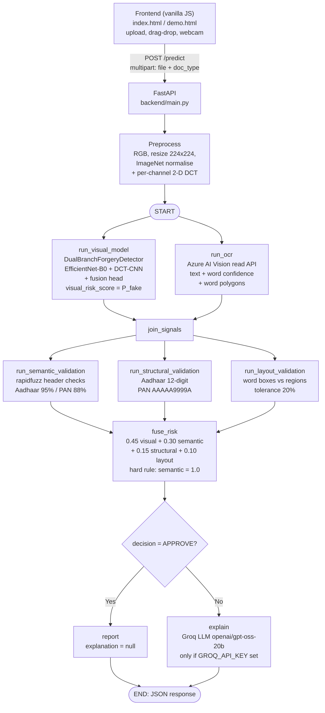

# KYCGuard

> Multi-signal risk assessment for Indian KYC documents (Aadhaar & PAN): a **CNN + DCT visual forensics** model, **Azure AI Vision OCR**, and **rule-based text / structure / layout validation**, fused into a single explainable risk score.

> **Prototype / final-year B.Tech project — not a production KYC verification system.** KYCGuard flags *indicators of tampering and inconsistency*. It does not verify identity, does not consult government records, and does not prove that a document is genuine.

---

## Table of Contents

- [Overview](#overview)
- [Key Features](#key-features)
- [Problem Statement](#problem-statement)
- [Solution](#solution)
- [System Architecture](#system-architecture)
- [End-to-End Workflow](#end-to-end-workflow)
- [Visual Forensics Model](#visual-forensics-model)
- [OCR and Document Intelligence](#ocr-and-document-intelligence)
- [Validation Pipeline](#validation-pipeline)
- [Aadhaar Validation](#aadhaar-validation)
- [PAN Validation](#pan-validation)
- [Risk Fusion and Final Decision](#risk-fusion-and-final-decision)
- [Backend Architecture](#backend-architecture)
- [Frontend](#frontend)
- [API Endpoints](#api-endpoints)
- [Tech Stack](#tech-stack)
- [Project Structure](#project-structure)
- [Installation](#installation)
- [Environment Variables](#environment-variables)
- [Running the Project](#running-the-project)
- [Testing](#testing)
- [Model / Training Information](#model--training-information)
- [Dataset](#dataset)
- [Results / Evaluation](#results--evaluation)
- [Limitations](#limitations)
- [Future Improvements](#future-improvements)
- [Security Considerations](#security-considerations)
- [Disclaimer](#disclaimer)
- [License](#license)

---

## Overview

KYCGuard analyses a single scanned or phone-captured image of an Aadhaar or PAN card and returns a **graded risk assessment** (`LOW_RISK` / `MEDIUM_RISK` / `HIGH_RISK`) together with a **decision** (`APPROVE` / `REVIEW_REQUIRED` / `SUSPICIOUS`) instead of a naive pass/fail.

Four independent signals are computed and then fused with fixed weights:

| # | Signal | What it looks at |
|---|--------|------------------|
| 1 | **Visual forensics** | Pixel-level and frequency-domain artefacts of tampering, via a dual-branch CNN |
| 2 | **Semantic validation** | Fuzzy match of the document's official headers against expected strings |
| 3 | **Structural validation** | Format of the identifier (12-digit Aadhaar number, PAN pattern) |
| 4 | **Layout consistency** | Whether OCR'd fields land inside calibrated template regions |

When the fused decision is *not* `APPROVE`, an optional LLM step (Groq) writes a short plain-English explanation grounded strictly in the evidence produced by those four signals.

The service is a single FastAPI endpoint (`POST /predict`) driven by a **LangGraph** state graph, with a two-page vanilla-JS frontend (landing page + live demo with webcam capture).

---

## Key Features

- **Dual-branch visual forensics** — EfficientNet-B0 (spatial) + a DCT frequency CNN, concatenated and classified through a learned fusion head (`training/model.py`).
- **Azure AI Vision OCR** — Image Analysis 4.0 `read` feature; returns full text, per-word confidence and per-word bounding polygons.
- **Strict mandatory-phrase validation for Aadhaar** — `GOVERNMENT OF INDIA` / `भारत सरकार` are checked at a **95%** fuzzy threshold (vs 88% for general checks), with known OCR errata normalised before scoring.
- **Grouped Aadhaar number handling** — finds `1234 5678 9012` style 4-4-4 groups as well as contiguous 12-digit runs, tolerating spaces, hyphens, dots and commas.
- **Calibrated layout validation** — OCR word boxes tested against per-document relative template regions with ±20% tolerance.
- **Deterministic risk fusion** with a **hard override**: any semantic failure forces `HIGH_RISK` / `SUSPICIOUS`.
- **LangGraph orchestration** — visual and OCR branches run in parallel, then the three validators run in parallel, then fusion.
- **LLM explanation layer** (optional, Groq) for non-approved documents.
- **Webcam capture + drag-and-drop upload** in the browser, no build step.

---

## Problem Statement

KYC document fraud in India combines several attack modes that no single check catches:

1. **Visual tampering** — edited fields, re-compressed screenshots, spliced faces, blur/noise added to hide edits, affine warps from copy-paste.
2. **Content substitution** — headers or names that do not match the document type, misspelled official strings, swapped fields.
3. **Format violations** — malformed or missing Aadhaar/PAN identifiers.
4. **Template deviations** — required fields appearing where they should not be on a genuine card.

A pure OCR pipeline misses (1); a pure image classifier misses (2)–(4); a pure rule engine misses (1). Meanwhile, "it passed OCR" is frequently misread as "it is genuine".

---

## Solution

KYCGuard treats forgery detection as a **multi-signal measurement problem**:

- A **learned visual signal** scores manipulation artefacts in both the spatial and frequency domain.
- **Rule-based text signals** score semantic, structural and layout consistency using the OCR output.
- A **transparent weighted fusion** combines them into one score and decision, with an explicit hard rule so that a clear semantic failure cannot be averaged away by a clean-looking image.
- Every stage emits structured `failed_checks` so the final explanation is *grounded*, not free-form.

---

## System Architecture



Graph edges are defined in `backend/graph.py`: `START` fans out to `run_visual_model` and `run_ocr`; both fan into `join_signals`; `join_signals` fans out to the three validation nodes; all three fan into `fuse_risk`; `fuse_risk` routes conditionally to `report` or `explain`, both of which end at `END`.

---

## End-to-End Workflow

1. **Document upload** — The user selects `AADHAAR` or `PAN` in the UI and uploads an image (file picker, drag-and-drop, or live webcam capture). The document type is **client-declared**, not auto-detected; the API rejects any other value with `400`.
2. **Input validation & preprocessing** — The server checks `content_type` is `image/*`, the body is non-empty, and `doc_type` ∈ {`AADHAAR`, `PAN`}. The image is decoded to RGB and turned into two model views: a 224×224 ImageNet-normalised spatial tensor and a 224×224 per-channel DCT frequency tensor.
3. **Parallel signal extraction**
   - `run_visual_model` — the dual-branch CNN emits `visual_risk_score` = softmax probability of the *fake* class.
   - `run_ocr` — Azure AI Vision reads the image and emits `extracted_text`, `ocr_confidence`, `ocr_source` (`azure` / `azure_failed`) and per-word geometry.
4. **Join** — `join_signals` waits for both branches.
5. **Parallel validation** — semantic, structural and layout validators run concurrently on the OCR output and geometry.
6. **Risk fusion** — `fuse_risk` computes the weighted score, applies the semantic hard override, and picks the category + decision.
7. **Explanation routing** — `APPROVE` skips the LLM; otherwise `explain` builds an evidence block from all signals and asks Groq for a 2–3 sentence explanation (or returns a "GROQ_API_KEY not set" placeholder).
8. **Response** — one JSON object with every per-signal score, failed checks, OCR sample, final decision and explanation.

If **Azure OCR fails**, there is **no fallback engine**: `ocr_source` becomes `azure_failed`, `extracted_text` is empty, confidence is `0.0`, and a retry warning is attached. Because semantic and structural validation then both fail on empty text, the semantic hard rule forces the request to `HIGH_RISK` / `SUSPICIOUS` with a score of `1.0`.

---

## Visual Forensics Model

Implementation: `training/model.py` → **`DualBranchForgeryDetector`**, weights in `checkpoints/best_model.pt`.

The model is a **binary classifier** (class `0` = real / unmodified, class `1` = fake / tampered) with two parallel feature extractors and a learned fusion head.

### Inputs (both `(B, 3, 224, 224)`)

| View | Construction |
|------|--------------|
| **Spatial (RGB)** | Bilinear resize to 224×224, pixels `/255`, then per-channel ImageNet normalisation — mean `[0.485, 0.456, 0.406]`, std `[0.229, 0.224, 0.225]` |
| **Frequency (DCT)** | On the same 224×224 image in 0–255 range: a full-image **2-D DCT (type-II, ortho-normalised, `scipy.fft.dctn`) per channel**, then `log1p(abs(coeffs))` to compress dynamic range, then **per-channel min–max normalisation to [0, 1]** |

The DCT view is computed identically at training time (`training/dataset.py`) and at inference time (`backend/main.py`), so the two branches always see consistent inputs. Note that augmentations (rotation, flip, brightness, contrast, blur) are applied **only to the spatial view** during training; the frequency branch always sees the clean image.

### Branch 1 — Spatial: EfficientNet-B0

- `timm.create_model("efficientnet_b0", num_classes=0, global_pool="avg")` — ImageNet-pretrained backbone with the classifier head removed.
- Output: a **1280-d** pooled feature vector.

### Branch 2 — Frequency: DCT-CNN

Three convolutional blocks (`training/model.py` → `FrequencyBranch`):

```
Conv2d(3→32, k3, p1)  → BatchNorm → ReLU → MaxPool2    # 224 → 112
Conv2d(32→64, k3, p1) → BatchNorm → ReLU → MaxPool2    # 112 → 56
Conv2d(64→128, k3, p1)→ BatchNorm → ReLU → AdaptiveAvgPool2d(1)
Linear(128 → 128)                                          # → 128-d vector
```

This branch is the "forensic" one: it is designed to surface JPEG/compression fingerprints, blur, noise and re-rendering artefacts that can be subtle in pixel space but show up as DCT coefficient patterns. (This is the design rationale documented in `training/dct_utils.py` — the shipped metrics below are the only measured evidence.)

### Fusion head

```
concat(1280, 128) = 1408
  → Linear(1408 → 256) → BatchNorm1d → ReLU → Dropout(0.4)
  → Linear(256  → 64)  → BatchNorm1d → ReLU → Dropout(0.4)
  → Linear(64   → 2)   # logits for [real, fake]
```

### Inference output

`run_visual_model` applies `softmax` and takes `probs[0, 1]` — the **probability of the "fake" class** — as `visual_risk_score`. It is bucketed for display as `< 0.3 → LOW_RISK`, `< 0.6 → MEDIUM_RISK`, `≥ 0.6 → HIGH_RISK` (`backend/main.py::_to_status`).

### What the score actually means

It is a **manipulation-artefact screening score**, not proof of authenticity. The model learned to separate *procedurally generated* forgeries (JPEG recompression, blur, noise, affine warp, field edits, face compositing, border crops) from *procedurally generated* clean cards. It has never seen a government issuing authority's records, a QR code decode, or a checksum — so a low score means "no familiar tampering signature was detected", **not** "this card is genuine".

### Explainability

`python -m training.grad_cam --image path/to/document.jpg` produces Grad-CAM heatmaps over the spatial branch so you can see which regions drove the decision.

---

## OCR and Document Intelligence

**Current OCR engine: Azure AI Vision (Image Analysis 4.0)** — `src/ocr/azure_ocr.py`, class `AzureOCREngine`. It is the **only** engine wired into the request path (`backend/graph.py` imports it directly).

### How it is called

- Endpoint: `POST {AZURE_VISION_ENDPOINT}/computervision/imageanalysis:analyze?api-version=2024-02-01&features=read`
- Auth header: `Ocp-Apim-Subscription-Key: {AZURE_VISION_KEY}`
- Body: the image re-encoded to JPEG (RGB→BGR, longest side capped at **2000 px**, quality **85**), sent as `application/octet-stream`
- Timeout 20 s, **one retry** on `429 / 500 / 503` and on transport errors, with a 0.5 s backoff

### What is extracted

The response is parsed defensively across `readResult.lines`, `readResult.pages[].lines` and `readResult.blocks[].lines`, producing:

| Output | Description |
|--------|-------------|
| `full_text` | All detected line texts joined with spaces |
| `avg_confidence` | Mean of per-word `confidence` values (falls back to `1.0` if text exists but no confidences, `0.0` if nothing was read) |
| `ocr_results` | One record per word: `{text, confidence, bbox: [x_min, y_min, x_max, y_max]}` derived from the word's `boundingPolygon` |

That per-word geometry is what feeds **layout validation** — Azure's bounding polygons are the geometry source for the current pipeline.

### Post-processing

- `src/ocr/text_normalizer.py::normalize` — Unicode **NFC** normalisation, trimming, and whitespace collapsing applied to the Azure text before validation.
- Quality warning when `0 < confidence < 0.5` (`OCR_CONFIDENCE_WARNING_THRESHOLD` in `config/risk_weights.py`): *"Image quality is low — OCR results may be unreliable…"*
- Empty read → *"No text could be extracted from the image…"*
- Engine exception → `ocr_source = "azure_failed"`, empty text, confidence `0.0`, warning *"Azure OCR failed. Please retry with a clearer image."*

> **Legacy / experimental OCR code that is NOT part of the live pipeline:** `src/ocr/gemini_engine.py` (Gemini), `src/ocr/ocr_engine.py` (EasyOCR, `en`+`hi`), and `src/ocr/preprocessing.py` (deskew → CLAHE → bilateral denoise). They are only reachable from the manual comparison scripts `test_ocr_comparison.py` and `scripts/test_gemini_ocr.py`. No Mistral OCR engine is imported anywhere in the current pipeline. There is **no automatic OCR fallback** in `backend/graph.py`.

---

## Validation Pipeline

All validators return a **binary-ish risk in `[0, 1]`** plus a list of human-readable `failed_checks` strings, which are surfaced verbatim in the API response and in the UI's "Reasons flagged" list.

| Stage | Module | Input | Risk |
|-------|--------|-------|------|
| Text normalisation | `src/ocr/text_normalizer.py` | raw Azure text | — (preprocessing step) |
| **Semantic validation** | `src/validation/{aadhaar,pan}_validator.py::validate_semantic` | normalised text | `1.0` if any expected header check fails, else `0.0` |
| **Structural validation** | `…::validate_structural` | normalised text | `1.0` if the identifier is missing/malformed, else `0.0` |
| **Layout validation** | `src/validation/layout_validator.py::validate_layout` | `ocr_results` + image `width`/`height` + `doc_type` | **fraction** of expected fields not found in their region (0.0 – 1.0) |
| Document dispatch | `backend/graph.py::_run_semantic/_run_structural/_run_layout` | `doc_type` | routes to the Aadhaar or PAN implementation |

### Layout validation details

1. The configured **relative** region `(x_min, y_min, x_max, y_max)` for each field is scaled to pixel coordinates using the uploaded image's `width`/`height`.
2. The region is expanded by **±20%** (`TOLERANCE = 0.20`) on each side.
3. Each OCR word box is tested for axis-aligned overlap; overlapping words are concatenated into that region's text.
4. A field with **no** overlapping word counts as missing.
5. `risk = missing / total_fields`.

Fields checked:

- **Aadhaar** (`REGIONS` in `src/config.py`): `name`, `dob`, `gender`, `aadhaar_num`
- **PAN** (`PAN_REGIONS` in `src/pan_config.py`): `pan_num`, `name`, `father_name`, `dob`

---

## Aadhaar Validation

Implemented in `src/validation/aadhaar_validator.py`.

### Mandatory phrases (semantic)

```python
AADHAAR_EXPECTED_STRINGS = [
    ("GOVERNMENT OF INDIA", "Official English header"),
    ("भारत सरकार",           "Official Hindi header"),
]
FUZZY_THRESHOLD          = 88   # general
MANDATORY_FUZZY_THRESHOLD = 95  # these two phrases
```

**Scoring** (`_validate_phrase`):

1. Lowercase both strings and collapse whitespace.
2. `partial = fuzz.partial_ratio(expected, text)`.
3. For **each word of the expected phrase**, take the best `fuzz.ratio` against any word in the OCR text.
4. Return `min(partial, min_word_over_expected_words)` — i.e. the *weakest* expected word caps the score. A document that gets `GOVERNMENT` right but `OF`/`INDIA` wrong cannot score high.

**Erratum normalisation** — the best of the raw score and a normalised score is used:

| Target | Normalisation | Why |
|--------|---------------|-----|
| Hindi header | `भारत` → `भरत` applied to *both* expected and OCR text | common OCR drop of the *ā* matra |
| English header | `OE` → `OF`, `INDIYA` → `INDIA` | common OCR substitutions |

**Hard-failure behaviour:** because both phrases are mandatory, `score < 95` records a failed check and the validator returns risk `1.0`, which the fusion layer then treats as a hard override (see below). Verified examples:

| OCR text | Score | Result |
|----------|-------|--------|
| `GOVERNMENT OF INDIA भारत सरकार` | 100 | pass |
| `GOVERNMENT OF INDIYA भरत सरकार` (errata) | 100 after normalisation | pass |
| `GOVERMENT OF INDIA` (dropped *N*) | 94.44 | **fail** |
| `GOVERNMENT OF INDIAA` (extra *A*) | 90.91 | **fail** |
| empty text | 0.0 | **fail** |

Formatting differences that *are* tolerated: extra/missing whitespace, case differences, and arbitrary placement of the phrases anywhere in the OCR text (it is a partial match, not an exact-line match). What is **not** tolerated is a meaningful character-level misspelling of a mandatory phrase.

### Aadhaar number (structural)

`_extract_aadhaar_number` tries, in order:

1. Strip whitespace, hyphens, dots and commas, then match `(?<!\d)\d{12}(?!\d)` (exactly 12 digits, not embedded in a longer digit run).
2. Match a `(\d{4})\s+(\d{4})\s+(\d{4})` 4-4-4 group in the **raw** text and concatenate → handles `1234 5678 9012`.
3. Fallback: any 12 consecutive digits in the cleaned text.

If none is found → risk `1.0` with `"Aadhaar number not found in extracted text"`; if found but not 12 digits / not all digits → risk `1.0` with a format message. Otherwise `0.0`.

> The structural check validates **shape only**. It does **not** verify a Verhoeff checksum (even though the *dataset generator* in `src/data_utils.py` does produce Verhoeff-valid numbers), and it does **not** decode the card's QR code.

---

## PAN Validation

Implemented in `src/validation/pan_validator.py`.

### Headers (semantic)

```python
PAN_EXPECTED_STRINGS = [
    ("INCOME TAX DEPARTMENT", "Official English header"),
    ("GOVT. OF INDIA",        "Official government header"),
]
FUZZY_THRESHOLD = 88
```

Same `min(partial_ratio, weakest-word ratio)` scoring as Aadhaar, with a single extra variant for `INCOME TAX DEPARTMENT`: the score is also recomputed with **all whitespace removed** from both strings (so `INCOME TAX DEPARTMENT` / `INCOMETAXDEPARTMENT` both match), and the maximum of the two is used. Threshold is **88** — PAN has no 95% mandatory-phrase rule.

### PAN number (structural)

1. Match `(?<![A-Za-z0-9])[A-Z]{5}[0-9]{4}[A-Z](?![A-Za-z0-9])` on the raw text.
2. Else strip spaces/hyphens and retry with a strict variant.
3. Not found → risk `1.0` with `"PAN number not found in extracted text"`.

The pattern is **case-sensitive** (the OCR text is not upper-cased before matching), and the final check letter is **not** validated against any checksum. There is no PAN-specific layout or mandatory-phrase hard rule beyond the above.

---

## Risk Fusion and Final Decision

Implementation: `fusion/risk_engine.py::fuse`, weights/thresholds in `config/risk_weights.py`.

### Inputs

Four scalars, each in `[0, 1]`:

| Signal | Source | Weight |
|--------|--------|--------|
| `visual` | `visual_risk_score` — CNN `P(fake)` | **0.45** |
| `semantic` | `semantic_risk_score` — 0.0 / 1.0 | **0.30** |
| `structural` | `structural_risk_score` — 0.0 / 1.0 | **0.15** |
| `layout` | `layout_risk_score` — fraction of fields missing | **0.10** |

### Calculation

```
final_risk_score = 0.45·visual + 0.30·semantic + 0.15·structural + 0.10·layout
```

### Hard override

```python
if semantic >= 1.0:        # any mandatory header check failed
    category, decision = "HIGH_RISK", "SUSPICIOUS"
    risk_score = 1.0        # weighted sum is clamped up to 1.0
```

A clean-looking image **cannot** rescue a document that fails semantic validation. This is also why a total Azure OCR failure (empty text) deterministically ends in `SUSPICIOUS`.

### Decision bands

| `final_risk_score` | Category | Decision |
|--------------------|----------|----------|
| `< 0.30` | `LOW_RISK` | `APPROVE` |
| `< 0.60` | `MEDIUM_RISK` | `REVIEW_REQUIRED` |
| `≥ 0.60` | `HIGH_RISK` | `SUSPICIOUS` |

Verified reference points from the actual implementation: `visual=0.10, all else 0` → `0.045` → `APPROVE`; `visual=0.50, all else 0` → `0.225` → `APPROVE`; `visual=0.90, structural=1.0, layout=1.0` → `0.655` → `SUSPICIOUS`; `semantic=1.0` → `1.0` → `SUSPICIOUS`.

### Visual score buckets (display only)

`visual_forensics.status` uses the same `0.3 / 0.6` cut-offs but is reported independently of the fused result.

---

## Backend Architecture

### FastAPI — `backend/main.py`

- `load_project_env()` resolves `backend/.env` then `.env` from the **project root** (CWD-independent) using `override=False`, so real environment variables always win.
- The model checkpoint is loaded **once at import time**; the Azure client is created **lazily on the first request** and reused.
- Device selection: `mps` (Apple Silicon) if available, otherwise `cpu`.
- CORS is restricted to `http://localhost:5500` and `http://127.0.0.1:5500` (the static frontend's origin).
- Validation errors → `400`: non-`image/*` content type, empty body, or `doc_type` outside `{AADHAAR, PAN}`.

### LangGraph state graph — `backend/graph.py`

`GraphState` (a `TypedDict`) carries:

```
image, doc_type, spatial, freq,
visual_risk_score,
ocr_confidence, ocr_source, ocr_quality_warning, ocr_results,
extracted_text, extracted_text_sample,
semantic_risk_score, semantic_checks,
structural_risk_score, structural_checks,
layout_risk_score, layout_checks,
final_risk_score, final_category, decision, explanation
```

Nodes and execution order:

| Node | Role |
|------|------|
| `run_visual_model` | CNN forward pass → `visual_risk_score` |
| `run_ocr` | Azure OCR → text, confidence, geometry, warnings |
| `join_signals` | Fan-in for the two parallel branches |
| `run_semantic_validation` | Aadhaar/PAN header fuzzy checks |
| `run_structural_validation` | Aadhaar/PAN identifier checks |
| `run_layout_validation` | Word boxes vs calibrated regions |
| `fuse_risk` | Weighted fusion + hard rule + banding |
| `report` | Sets `explanation = None` (approved path) |
| `explain` | Groq LLM explanation (non-approved path) |

`run_visual_model` and `run_ocr` execute **concurrently** (both hang off `START`), as do the three validation nodes (all hang off `join_signals`). Fusion waits for all three.

### LLM explanation — `explain`

- Reads `GROQ_API_KEY` from the environment; if unset, returns `"Explanation unavailable: GROQ_API_KEY not set."`
- Model: `openai/gpt-oss-20b` via `langchain_groq.ChatGroq`.
- The prompt is built from a fixed evidence block (`decision`, `final_risk_score`, and each signal's score + `failed_checks`) and instructs the model to **only reference listed findings** and to write 2–3 plain-English sentences for a non-technical reviewer.

---

## Frontend

Static files in `frontend/` — **vanilla HTML/CSS/JS with no build step** (Lucide icons and Google Fonts loaded from CDN).

| File | Purpose |
|------|---------|
| `index.html` + `landing.js` | Landing page: hero, "How It Works" cards for the four signals, scroll/typewriter effects |
| `demo.html` + `demo.js` | Live demo tool |
| `styles.css` | Shared styling for both pages |

**Demo flow (`frontend/demo.js`):**

1. Choose document type (`AADHAAR` / `PAN` radio).
2. Provide an image via **file picker**, **drag-and-drop**, or **live webcam capture** (`getUserMedia` → `<canvas>` → JPEG blob → `File`, with retake and stream-teardown on page hide).
3. `POST` as `FormData` to `http://localhost:8080/predict` — **the backend must listen on port 8080**.
4. Render results:
   - four **signal cards** — *Visual Forensics*, *OCR / Text Consistency*, *Document Structure*, *Layout Consistency* — each with status badge, percentage score and bullet-listed `failed_checks`;
   - a **final decision** panel with category badge, decision badge, animated risk bar, and a "Reasons flagged" list;
   - the **OCR sample text** with an `Azure OCR` badge and any quality warning;
   - the **LLM explanation** box when present.

---

## API Endpoints

### `POST /predict`

`multipart/form-data`

| Field | Type | Description |
|-------|------|-------------|
| `file` | image/* | Document image (JPEG/PNG/WebP…) |
| `doc_type` | string | `AADHAAR` (default) or `PAN` |

```bash
curl -F "file=@aadhaar.jpg" -F "doc_type=AADHAAR" http://localhost:8080/predict
```

### Response schema

```jsonc
{
  "document_type": "AADHAAR",
  "visual_forensics": {
    "risk_score": 0.9000,        // CNN P(fake)
    "status": "HIGH_RISK"        // <0.3 LOW · <0.6 MEDIUM · ≥0.6 HIGH
  },
  "ocr": {
    "confidence": 0.8231,        // mean per-word Azure confidence
    "source": "azure",           // "azure" | "azure_failed"
    "quality_warning": null,     // low-confidence / no-text / Azure-failure messages
    "extracted_text_sample": "..." // first 500 chars
  },
  "semantic_validation":   { "risk_score": 0.0, "failed_checks": [] },
  "structural_validation": { "risk_score": 1.0, "failed_checks": ["Aadhaar number not found in extracted text"] },
  "layout_validation":     { "risk_score": 0.75, "failed_checks": ["Name not found in expected region", "Gender not found in expected region", "Aadhaar number not found in expected region"] },
  "final_decision": {
    "risk_score": 0.63,          // 0.45·0.90 + 0.30·0.0 + 0.15·1.0 + 0.10·0.75
    "category": "HIGH_RISK",
    "decision": "SUSPICIOUS"
  },
  "explanation": "The document was flagged because ..."  // null when approved
}
```

Errors: `400` for non-image content type, empty file, or invalid `doc_type`. FastAPI's interactive docs are served at `/docs` and `/redoc`.

---

## Tech Stack

Only what the current implementation actually imports:

| Area | Technologies |
|------|--------------|
| **Visual model (train + inference)** | PyTorch, timm (EfficientNet-B0), SciPy (`scipy.fft.dctn`), NumPy, Pillow |
| **Backend / orchestration** | FastAPI, uvicorn, python-multipart, LangGraph, langchain-groq, python-dotenv |
| **OCR** | Azure AI Vision — Image Analysis 4.0 REST (`api-version=2024-02-01`, `features=read`), `requests`, OpenCV (JPEG encoding) |
| **Validation** | rapidfuzz, Python `re` |
| **LLM explanation** | Groq via `langchain-groq` (`openai/gpt-oss-20b`) — optional |
| **Dataset generation** | OpenCV, Pillow, Pandas, tqdm, DeepFace (`tf-keras`), requests |
| **Evaluation / plots** | scikit-learn, matplotlib, seaborn |
| **Frontend** | Vanilla HTML / CSS / JS, Lucide icons, Google Fonts (CDN) |
| **Packaging** | Docker (`python:3.11-slim`) |

> `easyocr` (present in both requirements files) and `google-genai` (present only in `requirements-backend.txt`) remain solely because the standalone OCR comparison scripts still import them; **neither is used by the live request path**.

---

## Project Structure

```
KYCGuard/
├── backend/
│   ├── __init__.py
│   ├── main.py                 # FastAPI app — POST /predict, preprocessing, CORS
│   ├── graph.py                # LangGraph state graph, Azure OCR wiring, LLM explanation
│   ├── .env.example            # GROQ_API_KEY, AZURE_VISION_ENDPOINT, AZURE_VISION_KEY
│   └── .env                    # local secrets (not committed)
├── config/
│   ├── __init__.py
│   └── risk_weights.py         # fusion weights, decision thresholds, OCR warning threshold
├── fusion/
│   ├── __init__.py
│   └── risk_engine.py          # weighted fusion + semantic hard override → category/decision
├── src/
│   ├── __init__.py
│   ├── ocr/                    # __init__.py + azure_ocr / text_normalizer / legacy engines
│   │   ├── azure_ocr.py        # ACTIVE — Azure AI Vision wrapper
│   │   ├── text_normalizer.py  # ACTIVE — NFC + whitespace normalisation
│   │   ├── ocr_engine.py       # legacy — EasyOCR wrapper (comparison script only)
│   │   ├── gemini_engine.py    # legacy — Gemini wrapper (comparison script only)
│   │   └── preprocessing.py    # legacy — deskew/CLAHE/denoise (EasyOCR path only)
│   ├── validation/
│   │   ├── __init__.py
│   │   ├── aadhaar_validator.py  # semantic (95% mandatory phrases) + structural
│   │   ├── pan_validator.py      # semantic (88%) + structural
│   │   └── layout_validator.py   # word boxes vs calibrated regions (±20%)
│   ├── config.py               # Aadhaar REGIONS, header region, fake-category probabilities
│   ├── pan_config.py           # PAN_REGIONS, fake-category probabilities
│   ├── env_config.py           # project-root .env loader (override=False)
│   ├── pipeline.py             # Aadhaar dataset generation orchestrator
│   ├── pan_pipeline.py         # PAN dataset generation orchestrator
│   ├── card_composer.py        # Aadhaar card compositor
│   ├── pan_card_composer.py    # PAN card compositor
│   ├── template_extractor.py   # blank-template extraction from real scans
│   ├── augmentor.py            # forgery augmentations (Aadhaar)
│   ├── face_analyzer.py        # DeepFace gender/age analysis + cache
│   ├── data_utils.py           # names/DOB/Aadhaar-number generators (Verhoeff)
│   ├── download_faces.py       # fetches synthetic face photos
│   ├── clean_pan_sample.png    # calibrated PAN template source
│   └── sample-pan-card.jpg
├── training/
│   ├── __init__.py
│   ├── model.py                # DualBranchForgeryDetector + FocalLoss
│   ├── config.py               # hyperparameters, paths, ImageNet stats, IMG_SIZE
│   ├── dataset.py              # identity-aware split + dual-view dataset
│   ├── dct_utils.py            # per-channel 2-D DCT → log-scale → [0,1]
│   ├── train.py                # two-phase training loop
│   ├── evaluate.py             # metrics + plots → results/
│   └── grad_cam.py             # Grad-CAM over the spatial branch
├── frontend/
│   ├── index.html              # landing page
│   ├── demo.html               # demo tool (upload + camera)
│   ├── demo.js                 # capture/upload → POST /predict → render results
│   ├── landing.js              # landing page animations
│   ├── styles.css
│   └── package-lock.json       # lockfile with zero packages (no npm dependencies)
├── scripts/
│   └── test_gemini_ocr.py      # standalone legacy Gemini smoke test
├── test_ocr_comparison.py      # manual EasyOCR vs Gemini comparison tool
├── calibrate.py                # visualises Aadhaar REGIONS on a real scan
├── calibrate_pan.py            # visualises PAN_REGIONS on the sample PAN
├── debug_calibration.jpg       # tracked output of calibrate.py
├── debug_calibration_pan.jpg   # tracked output of calibrate_pan.py
├── checkpoints/
│   ├── best_model.pt           # loaded by the backend at import
│   └── final_model.pt
├── data/
│   ├── aadhaar/real/           # 90 original Aadhaar scans
│   ├── faces/                  # 299 synthetic face photos
│   ├── templates/              # extracted Aadhaar templates + metadata.json
│   ├── pan_templates/          # extracted PAN template + metadata.json
│   ├── fonts/                  # NotoSans Regular/Bold
│   └── face_analysis_cache.json
├── output/                     # Aadhaar dataset (dataset.csv + real/ + fake/)
├── output_pan/                 # PAN dataset (pan_dataset.csv + real/ + fake/)
├── results/                    # test_metrics.json, training_history.json, PNG plots
├── requirements.txt            # full stack (generation + training + backend)
├── requirements-backend.txt    # backend/Docker image only
├── Dockerfile
├── .dockerignore / .gitignore
├── .kilo/                      # editor tool config (kilo.jsonc)
├── LICENSE                     # MIT
└── README.md
```

Not shown: `__pycache__/` directories and `*.pyc` files (currently tracked in git), `data/aadhaar/` + `data/templates/` metadata referenced above, and the per-image contents of `output/` / `output_pan/`.

---

## Installation

```bash
# 1. Virtual environment (Python 3.11 recommended — the Docker image uses 3.11)
python3 -m venv venv
source venv/bin/activate            # Windows: venv\Scripts\activate

# 2. Dependencies
pip install -r requirements.txt          # full: dataset generation + training + backend
# or, for the service only:
pip install -r requirements-backend.txt

# 3. Secrets
cp backend/.env.example backend/.env
#    then edit backend/.env:
#    AZURE_VISION_ENDPOINT=https://<your-resource>.cognitiveservices.azure.com/
#    AZURE_VISION_KEY=<your key>
#    GROQ_API_KEY=<your key>          # optional — enables the LLM explanation
```

**Optional — regenerate the datasets:**

```bash
python -m src.pipeline          # Aadhaar (needs data/aadhaar/real/ + data/faces/)
python -m src.pan_pipeline      # PAN (uses src/clean_pan_sample.png)
```

**Optional — retrain the model:**

```bash
python -m training.train        # two-phase: frozen backbone, then full fine-tune
python -m training.evaluate     # writes metrics + plots to results/
python -m training.grad_cam --image path/to/document.jpg
```

The repository already ships a trained checkpoint (`checkpoints/best_model.pt`), so training is **not** required to run the service.

---

## Environment Variables

Variable **names** only — never commit real values.

| Variable | Required for | Purpose |
|----------|--------------|---------|
| `AZURE_VISION_ENDPOINT` | OCR | Azure AI Vision resource endpoint |
| `AZURE_VISION_KEY` | OCR | Azure AI Vision subscription key |
| `GROQ_API_KEY` | explanation layer | Enables the Groq LLM explanation; without it `explanation` is a placeholder string |
| `PORT` | container | Port uvicorn binds to inside Docker (defaults to `8080`) |
| `GEMINI_API_KEY` | **legacy scripts only** | Read only by `scripts/test_gemini_ocr.py` / `src/ocr/gemini_engine.py` — **not** used by the live pipeline |

Loading rules (`src/env_config.py`): `backend/.env` and then `.env`, both resolved from the **project root**, loaded with `override=False` (real environment variables always win), and silently skipped when absent. `.env` files are excluded from git (`.gitignore`) and from the Docker build context (`.dockerignore`).

---

## Running the Project

**Backend** — must listen on **port 8080**, because `frontend/demo.js` posts to `http://localhost:8080/predict`:

```bash
uvicorn backend.main:app --host 127.0.0.1 --port 8080
```

> Avoid `--reload`: the module loads the model checkpoint at import time and the OCR client on first use, so a reload watchdog would re-run heavy initialisation on every file change. Interactive docs: `http://127.0.0.1:8080/docs`.

**Frontend** — serve the static folder on port **5500** (the allowed CORS origin):

```bash
cd frontend
python -m http.server 5500
```

- Landing page: `http://localhost:5500/index.html`
- Demo tool: `http://localhost:5500/demo.html`

**Docker:**

```bash
docker build -t kycguard .
docker run -p 8080:8080 -e AZURE_VISION_ENDPOINT=... -e AZURE_VISION_KEY=... -e GROQ_API_KEY=... kycguard
```

The container runs `uvicorn backend.main:app --host 0.0.0.0 --port $PORT` with `PORT` defaulting to `8080`. First-request warm-up (model + Azure client) takes a few seconds.

---

## Testing

There is **no automated unit-test suite** (no pytest/tox configuration in the repository). What exists:

| Command | What it does |
|---------|--------------|
| `python -m training.evaluate` | Re-runs inference on the held-out test split and writes `results/test_metrics.json`, `confusion_matrix.png`, `roc_curve.png`, `training_curves.png` |
| `python test_ocr_comparison.py [image.jpg ...]` | Manual side-by-side **EasyOCR vs Gemini** comparison on sample images (legacy tooling; requires `easyocr` and `GEMINI_API_KEY`) |
| `python scripts/test_gemini_ocr.py` | Manual single-image Gemini smoke test (legacy; requires `GEMINI_API_KEY` and a sample image path hardcoded inside the script) |
| `curl -F "file=@sample.jpg" -F "doc_type=AADHAAR" http://localhost:8080/predict` | End-to-end API smoke test |
| `python calibrate.py` / `python calibrate_pan.py` | Draw the calibrated layout regions over a reference card to visually verify region geometry |

---

## Model / Training Information

**Architecture:** `DualBranchForgeryDetector` (`training/model.py`)

| Component | Detail |
|-----------|--------|
| Spatial branch | EfficientNet-B0 (timm, ImageNet-pretrained, `num_classes=0`, avg pool) → **1280-d** |
| Frequency branch | Conv 3→32→64→128 (BN/ReLU/MaxPool, adaptive avg pool) → FC → **128-d** |
| Fusion head | `concat(1408)` → Linear 256 → BN/ReLU/Dropout 0.4 → Linear 64 → BN/ReLU/Dropout 0.4 → Linear **2** |
| Loss | Focal loss, α = 0.25, γ = 2.0 |
| Optimiser | AdamW, weight decay `1e-4`, gradient clipping `1.0` |
| Input size | 224 × 224 |

**Two-phase training** (`training/train.py`):

| Phase | Backbone | Epochs | LR |
|-------|----------|--------|----|
| 1 — warm-up | frozen | 5 | `1e-3` for frequency branch + fusion head |
| 2 — fine-tune | unfrozen | up to 30 (early stopping, patience 10) | differential: backbone `1e-5`, frequency `2.5e-4`, fusion `5e-4` |

Schedulers are `CosineAnnealingWarmRestarts` (`T_0=2` in phase 1, `T_0=5` in phase 2). Device auto-selects MPS → CUDA → CPU in `training.train`.

**Split hygiene:** `training/dataset.py` uses an **identity-aware split** (`GroupShuffleSplit` keyed on `face_file`, ratios 70/15/15, seed 42) so every document rendered from the same face lands in exactly one split — the model cannot memorise faces instead of learning forgery patterns. The split routine prints and checks for face leakage across train/val/test.

**Shipped checkpoint:** `checkpoints/best_model.pt` loads into `DualBranchForgeryDetector` with **zero missing/unexpected keys**. Its metadata records: phase `Phase 2 — Full Fine-Tune`, epoch `15`, `val_loss 0.0166`, `val_acc 0.9148`.

**Runtime preprocessing** replicates `training/grad_cam.prepare_image` exactly (`backend/main.py::_preprocess`): bilinear resize → `/255` → ImageNet normalisation for the spatial view, and `compute_dct` on the 0–255 array for the frequency view.

---

## Dataset

The CNN is trained on **procedurally generated documents**, not on collected real-world forgeries.

| | Aadhaar | PAN |
|---|---------|-----|
| Generator | `src/pipeline.py` | `src/pan_pipeline.py` |
| Source material | 90 original scans in `data/aadhaar/real/` | single calibrated template `src/clean_pan_sample.png` |
| Templates | extracted blank cards via `src/template_extractor.py` | `src/pan_pipeline.py::extract_pan_template` |
| Face photos | `data/faces/` (synthetic faces from *thispersondoesnotexist*), gender/age via DeepFace and cached | same |
| On disk | `output/dataset.csv` → **490** samples: **290 real** (90 original + 200 synthetic) / **200 fake** | `output_pan/pan_dataset.csv` → **600** samples: **300 real** / **300 fake** |

**Combined: 1,090 generated samples** (590 real / 500 fake) across the two datasets.

Fake samples each combine **2–3 tampering categories** drawn from `FAKE_CATEGORIES_PROBS` / `PAN_FAKE_CATEGORIES_PROBS`:

| Category | Prob. | Examples |
|----------|-------|---------|
| `semantic` | 0.50 | gender swap, age mismatch, malformed Aadhaar/PAN |
| `partial_editing` | 0.40 | single-field edit with font / shift / char-spacing penalty |
| `text_tampering` | 0.45 | font variation, character shift, blurred text |
| `image_quality` | 0.60 | JPEG quality 15–45, Gaussian blur, noise, colour jitter |
| `face_tampering` | 0.35 | face brightness / compositing mismatch |
| `structural` | 0.25 | affine warp ≈ ±3°, global shifts |
| `border_crop` | 0.20 | cropped edges, copy-paste border artefacts |

Real synthetic cards are rendered **semantically consistent** (face gender ↔ name, face age ↔ DOB, valid-format identifiers — Aadhaar numbers carry a Verhoeff check digit, PAN numbers follow `AAAPL1234C`), so the model cannot win by detecting meaningless content.

---

## Results / Evaluation

From `results/test_metrics.json`, produced by `python -m training.evaluate` on the **held-out identity-aware test set (145 samples)**:

| Metric | Score |
|--------|-------|
| Accuracy | **92.41%** |
| Precision | 96.43% |
| Recall | 85.71% |
| F1 score | 90.76% |
| AUC-ROC | **96.15%** |

Supporting artefacts in `results/`: `confusion_matrix.png`, `roc_curve.png`, `training_curves.png`, `training_history.json` (5 phase-1 + 25 phase-2 epochs recorded).

> Precision is much higher than recall: when KYCGuard's visual signal flags a document it is usually right, but it **misses some forgeries** (14.3% false negatives on this split). Treat it as a screening layer, not proof.
>
> These numbers come from **one recorded run on a synthetic dataset**. They are not a benchmark against real-world forged documents, and no external benchmark results are claimed.

---

## Limitations

Technically honest constraints, verified against the code:

1. **Format-valid ≠ authentic.** There is **no QR-code decoding, no Verhoeff checksum verification, no PAN check-letter validation, and no government database lookup**. Structural and layout checks verify syntax and placement only.
2. **Visual manipulation detection ≠ government-issued document verification.** The CNN detects *artefact patterns it was trained on*. A perfectly clean forgery that matches the training "real" distribution, or a genuine card photographed badly, can be scored wrongly in either direction.
3. **Synthetic-to-real domain gap.** Training data is procedurally rendered. Real-world retakes (photo-of-screen, re-printed, photocopied) may sit outside that distribution — reflected in the 85.71% recall.
4. **Single-template layout calibration.** Each document type has one hand-calibrated region map (`REGIONS`, `PAN_REGIONS`) with ±20% tolerance. Alternate/updated card editions, different scan aspect ratios, or rotated captures will produce spurious layout flags.
5. **OCR is a single point of failure.** There is deliberately **no fallback engine**: if Azure errors, text is empty, semantic + structural validation fail, and the hard rule forces `HIGH_RISK` / `SUSPICIOUS` regardless of how clean the image looks.
6. **Aggressive mandatory-phrase threshold.** The 95% Aadhaar threshold catches real misspellings but will also fail on a genuinely degraded OCR read of an authentic card — the failure is *binary* and immediately escalates to `SUSPICIOUS`.
7. **Case-sensitive PAN matching.** The PAN regex requires `[A-Z]{5}[0-9]{4}[A-Z]` against the OCR text as-is; lower-cased OCR output will fail structural validation.
8. **Image input only.** `content_type` must start with `image/`; PDFs and multi-page documents are not supported, and a corrupt image body surfaces as an unhandled server error rather than a `400`.
9. **Document type is client-declared.** The API does not detect whether the upload is an Aadhaar or a PAN card; a wrong selection applies the wrong validators.
10. **Hand-tuned fusion.** Weights (`0.45 / 0.30 / 0.15 / 0.10`) and cut-offs (`0.30 / 0.60`) are fixed constants, not learned or calibrated against labelled outcomes.
11. **Explanation layer is optional and unverified.** Without `GROQ_API_KEY` no explanation is produced; when produced, it is generated text constrained to (but not guaranteed faithful to) the evidence block.

---

## Future Improvements

Not implemented today:

- Automatic document-type detection instead of a client-declared `doc_type`.
- QR-code decoding and Verhoeff / check-letter verification for Aadhaar and PAN.
- A graceful OCR fallback or multi-engine consensus (the current design intentionally has none).
- Learned or calibrated fusion weights and per-signal thresholds instead of fixed constants.
- Template maps for alternate/newer card editions, plus rotation-invariant layout checks.
- Propagating Azure per-word confidence into semantic and layout scoring instead of binary checks.
- PDF / multi-page input support.
- Rate limiting, authentication and TLS if the service is ever exposed beyond localhost.
- Evaluation on a real-world forged-document benchmark.

---

## Security Considerations

- **Secrets live in `.env` only.** `.env` / `backend/.env` are git-ignored and excluded from the Docker build context (`.dockerignore`), and `src/env_config.py` loads them with `override=False` so injected runtime secrets take precedence. No key appears in source code, the README, or any API response.
- **Keys are transmitted only to Azure** (`Ocp-Apim-Subscription-Key` header) and **to Groq** for the explanation step.
- **Uploaded documents are processed in memory** — the request body is read into a `bytes` object and never written to disk by the backend.
- **CORS is pinned** to `http://localhost:5500` and `http://127.0.0.1:5500`; other origins are rejected by the browser middleware.
- **Still a prototype:** the service has no authentication, no rate limiting, no request-size limit and no TLS. Do not deploy it as-is to handle real personal data.

---

## Disclaimer

KYCGuard is a **final-year B.Tech / academic research prototype**. It is not a production KYC verification system, is not certified or approved by any authority, and must not be used as the sole basis for accepting or rejecting a person's identity. "Low risk" means *no indicator was found by this system's heuristics* — it does **not** mean a document is genuine, government-issued, or belongs to the person presenting it. Real KYC workflows must verify documents against official issuing-authority infrastructure (QR/checksum validation, database lookups, liveness and identity proofing) and comply with applicable regulations such as India's DPDP Act and RBI/UIDAI KYC directions.

---

## License

MIT — see [LICENSE](LICENSE).
